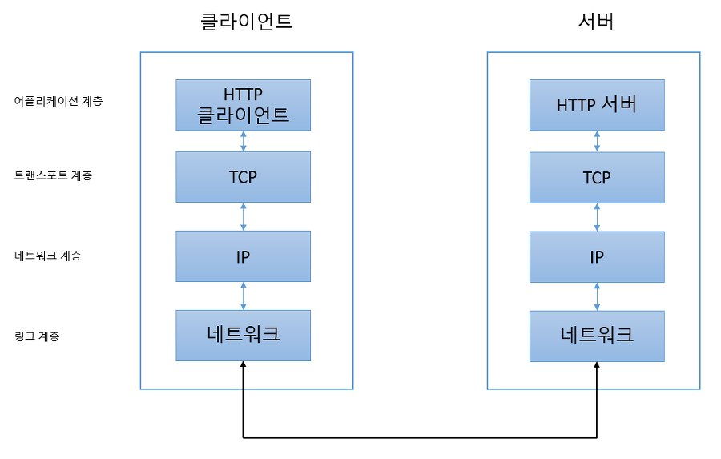
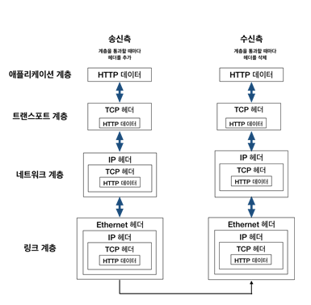

# 제 1장. 웹과 네트워크의 기본에 대해 알아보자
## 1.1. 웹은 HTTP 로 나타낸다
- HTTP : 클라이언트에서 서버까지 일련의 흐름을 결정하고 있는 프로토콜
- 웹은 HTTP 라는 약속을 사용한 통신으로 이루어진다

## 1.2. HTTP 는 이렇게 태어났고 성장했다
### 1.2.1. 웹은 지식 공유를 위해 고안되었다
- 멀리 떨어져 있는 동료 연구자와 지식을 공유하기 위한 시스템을 고안하였다
- 최초로 고안한 것이 하이퍼텍스트에 의해 상호간에 참조할 수 있는 WWW 의 기본 개념이 되는 것이었다
- WWW 를 구성하는 기술로서, `HTML`, 문서 전송 프로토콜로는 `HTTP`, 문서의 주소를 지정하는 방법으로 `URL` 등 3가지가 제안되었다
- WWW 는 지금으로 말하면 웹 브라우저이자 그 당시에는 하이퍼텍스트를 열람할 수 있는 클라이언트 애플리케이션의 명칭이었다

### 1.2.3. 진보 안하는 HTTP
- HTTP 는 등장 당시 주로 텍스트를 전송하기 위한 프로토콜이었지만, 프로토콜 자체가 상당히 심플하여 기능이 응용되면서 계속 추가되었다.
- 지금은 웹이라는 틀을 넘어 다양하게 사용되는 프로토콜이다

## 1.3. 네트워크의 기본은 TCP/IP
### 1.3.1. TCP/IP 는 프로토콜의 집합
- 인터넷을 포함하여 일반적으로 사용하는 네트워크는 TCP/IP 프로토콜에서 움직이는데, HTTP 는 그 중 하나이다
- TCP와 IP 프로토콜을 가리켜 TCP/IP 로 부르기도 하지만, IP 프로토콜을 사용한 통신에서 사용되고 있는 프로토콜을 총칭하여 TCP/IP 라는 이름이 사용되고 있다

### 1.3.2. 계층으로 관리하는 TCP/IP
- TCP/IP 는 애플리케이션, 트랜스포트, 네트워크, 링크 계층 4계층으로 나뉜다
- TCP/IP 가 계층화된 것은 계층화가 되어 있으면 사양이 변경된 해당 계층에만 변경사항이 생긴다
  - 또한 계층화하면 설계를 편하게 할 수 있다

#### 애플리케이션 계층
- 유저에게 제공되는 애플리케이션에서 사용하는 통신의 움직임을 결정한다
- TCP/IP 가 가진 여러 공통 애플리케이션에는, `FTP`, `DNS`, `HTTP` 등이 있다.

#### 트랜스포트 계층
- 서로 다른 성질을 가진 `TCP` (Transmission Control Protocol), `UDP` (User Datagram Protocol) 2가지 프로토콜이 있다

#### 네트워크 계층 (혹은 인터넷 계층)
- 네트워크 상에서 `패킷` 의 이동을 다루며, 어떠한 경로를 거쳐 상대 컴퓨터까지 패킷을 보낼지 결정하기도 한다

#### 링크 계층 (혹은 데이터 링크 계층, 네트워크 인터페이스 계층)
- 네트워크에 접속하는 `하드웨어`적인 면을 다룬다
- 디바이스 드라이버와 네트워크 인터페이스 카드 (NIC), 케이블 등 물리적으로 보이는 부분도 포함한다

### 1.3.3. TCP/IP 통신의 흐름

1. 애플리케이션 계층 (HTTP) 에서 어느 웹 페이지를 보고 싶다는 HTTP Request 지시
2. 트랜스포트 계층 (TCP) 에서는 애플리케이션 계층에서 받은 데이터 (HTTP 메시지) 를 통신하기 쉽게 조각내어 안내번호, 포트 번호를 붙여 네트워크 계층에 전달
3. 네트워크 계층 (IP) 에서는 수신지 MAC 주소를 추가해서 링크 계층에 전달
4. 수신 측 서버는 링크 계층에서 데이터를 받아들여 순서대로 위 계층에 전달하여 애플리케이션 계층까지 도달, 클라이언트가 발신한 HTTP Request 내용 수신

- 각 계층을 거칠 때는 반드시 헤더로 불려지는 해당 계층마다 **해당 계층에 필요한 정보를 추가** 한다

## 1.4. HTTP 와 관계가 깊은 프로토콜은 IP/TCP/DNS
### 1.4.1. 배송을 담당하는 IP
- IP 의 역할은 개개의 패킷을 상대방에게 전달하는 것이다
- 상대방에게 전달하려면 IP 주소와 MAC 주소가 중요하다
  - IP 주소 : 각 노드에 부여된 주소를 가리킨다
  - MAC 주소 : 각 네트워크 카드에 할당된 고유의 주소를 가리킨다
  - IP 주소는 변경 가능하지만, MAC 주소는 변경할 수 없다

#### 통신은 ARP 를 이용하여 MAC 주소에서 한다
- IP 통신은 MAC 주소에 의존해서 통신한다
- 인터넷에서 여러 대의 컴퓨터와 네트워크 기기를 중계해서 상대방에게 도착하는데, 다음으로 중계할 곳의 **MAC 주소를 사용하여 목적지를 찾아간다**
- 이 때, ARP (Address Resolution Protocol) 프로토콜이 사용된다
  - ARP 는 수신지의 IP 주소를 바탕으로 MAC 주소를 조사할 수 있다

  

#### 그 누구도 인터넷 전체를 파악하고 있지는 않다
- 목적지까지 중계하는 도중에 컴퓨터와 라우터 등의 네트워크 기기는 목적지에 도착하기까지 대략적인 목적지만을 알고 있다
  - 이 시스템을 라우팅이라고 부르는데, 택배 배송과 흡사하다
  - 택배 보내는 사람은 택배 집배소에만 들고가면 되고, 집배소는 어느 지역의 집배소에 보내면 되는지만 알면 되고, 목적지의 집배소는 어느 집에 배달하면 되는지만 알고 있다
  - 결국, 어떤 컴퓨터나 네트워크 기기도 인터넷 전체를 상세히 파악하고 있지 못하다는 것이다

### 1.4.2. 신뢰성을 담당하는 TCP
- TCP (Transmission Control Protocol) 은 신뢰성 있는 바이트 스트림 서비스를 제공한다
- 바이트 스트림 서비스란, 용량이 큰 데이터를 보기 쉽게 `TCP 세그먼트` 라고 불리는 단위 패킷으로 작게 분해하여 관리하는 것이다
- 결국 TCP 는 대용량 데이터를 보내기 쉽게 **작게 분해** 하여 상대방에게 보내고, **정확하게 도착했는지 확인** 하는 역할을 담당한다

#### 상대에게 데이터를 확실하게 보내는 것이 일이다
- Three-way-handshaking 방법을 사용하여 보내졌는지 여부를 SYN, ACK 라는 TCP 플래그를 사용하여 상대에게 확인한다

## 1.5. 이름 해결을 담당하는 DNS
- 도메인 이름과 IP 주소 이름 확인을 제공한다

## 1.6. 각각과 HTTP 와의 관계
1. 먼저 DNS에게 www.naver.com의 주소를 요청한다
2. DNS 는 www.naver.com 의 IP 주소를 알려준다
3. HTTP 담당 웹서버에 보낼 HTTP 메시지를 작성한다.
4. TCP 는 통신하기 쉽도록 HTTP 메시지를 패킷으로 분해하고 일련번호를 부여하고 상대방에게 패킷을 보낸다
5. IP 는 상대가 어디에 있는지 찾아 중계하면서 배송한다.
6. TCP 는 상대방으로부터 패킷을 수신하고 일련번호에 따라 조립한다.
7. 웹서버에 대한 Request 내용을 처리한다.
8. 리퀘스트 처리 결과도 마찬가지로 TCP/IP 통신 순서대로 클라이언트에 반환된다.

## 1.7. URI 와 URL
- URI는 리소스를 식별하기 위해 문자열 전반을 나타내는데 비해 URL은 리소스의 장소 (네트워크 상의 위치) 를 나타낸다.
  - URL은 URI의 서브셋이다.