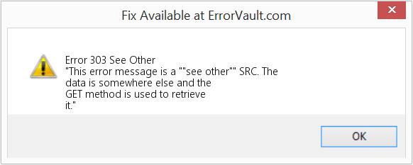
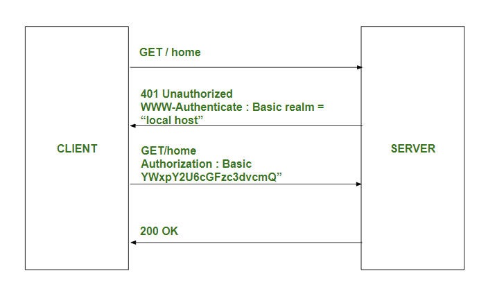

# 제 4장. 결과를 전달하는 HTTP 상태 코드

## 4.1 상태 코드는 서버로부터 리퀘스트 결과를 전달한다.
- 클라이언트가 서버를 향해 리퀘스트를 보낼 때 **서버에서 그 결과가 어떻게 되었는지 알려주는 것**이 상태 코드의 역할이다.
  |     | 클래스 | 설명           |
  | --- | --- | -------------- | 
  | 1xx | Informational | 리퀘스트를 받아들여 처리 중 |
  | 2xx | Success | 리퀘스트를 정상적으로 처리했음 |
  | 3xx | Redirection | 리퀘스트를 완료하기 위해서 추가 동작이 필요 |
  | 4xx | Client Error | 서버는 리퀘스트 이해 불가능 |
  | 5xx | Server Error | 서버는 리퀘스트 처리 실패 |

## 4.2 2XX 성공(Success)
- 리퀘스트가 정상적으로 처리되었음을 나타낸다.

### 4.2.1 200 OK
- 클라이언트가 보낸 리퀘스트를 서버가 정상 처리하였음을 나타낸다.

### 4.2.2 204 No Content
- 서버가 리퀘스트를 받아서 처리하는 데는 성공했지만 **리스폰스에 엔티티 바디를 포함하지 않는다**
- 클라이언트에서 서버에 정보를 보내는 것으로 족하고, 클라이언트에 대해서 **새로운 정보를 보낼 필요가 없는 경우**에 사용된다

### 4.2.3 206 Partial Content
- Range에 의해서 범위가 지정된 리퀘스트에 의해서 서버가 부분적 GET 리퀘스트를 받았음을 나타낸다.

## 4.3 3XX 리다이렉트(Redirection)
- 리퀘스트가 정상적으로 처리를 종료하기 위해 **브라우저 측에서 특별한 처리를 수행해야 함**을 나타낸다.

### 4.3.1 301 Move Permanently
- 리퀘스트된 리소스에는 **새로운 URI가 부여되어 있기 떄문에 이후로는 그 리소스를 참조하는 URI를 사용해야 한다는 것**을 나타낸다
- 결국 북마크하고 있는 경우에는 **Location 헤더 필드에서 가리키고 있는 URI에 북마크를 다시 하는 게 좋다**는 것을 나타낸다
- 디렉토리를 지정했을 떄 마지막 부분에 슬래시(/)를 붙이는 것을 잊은 경우 등에 발생한다
```http
// 클라이언트 요청
GET /index.php HTTP/1.1
Host: www.example.org

// 서버 응답
HTTP/1.1 301 Moved Permanently
Location: http://www.example.org/index.asp
```

### 4.3.2 302 Found
- 리퀘스트된 리소스에는 새로운 URI가 할당되어 있기 때문에 그 URI를 참조해주길 바란다는 의미이다
- 301과 비슷하지만 302의 경우에는 영구적인 이동이 아닌, 어디까지나 **일시적인** 것
  - 결국, 이동하는 곳의 URI는 앞으로 이동될 가능성이 있다 
- 검색엔진의 크롤링하는 페이지가 다르다.
  - ex. 인터넷 브라우저에서 사용자가 A라는 페이지를 요청했는데, Url이 B라는 페이지로 변경되었다면 해당 페이지는 리다이렉트가 되었다는 것을 뜻한다.
  - 이럴때, 301 리다이렉트를 한다면 검색엔진 크롤링에서는 B라는 페이지에 대한 수집을 하지만 302 리다이렉트를 한다면, A라는 페이지에 대해서 수집할 것이다.

### 4.3.3 303 See Other
- **리퀘스트에 대한 리소스는 다른 URI에 있기 때문에 GET 메서드를 사용해서 얻어야 한다**는 것을 나타낸다.
- 302와 같은 기능이지만 **리다이렉트 장소를 GET 메서드로 얻어야 한다**고 명확하게 되어있는 점이 302와 다르다.
- ex. POST 메서드로 액세스한 CGI 프로그램을 실행한 후에 처리 결과를 별도의 URI에 GET 메서드로 리다이렉트 시키고 싶은 경우


> 301, 302, 303 리스폰스 코드가 되돌아 오면 대부분의 브라우저에서는 POST를 GET으로 바꾸어서 리퀘스트의 엔티티 바디를 삭제하고 리퀘스트를 자동적으로 재송신하도록 되어 있다. 301, 302의 사양은 이러한 변경을 금지하고 있지만 구현해 놓은 것을 보면 이렇게 되어 있는 것이 대부분이다.

### 4.3.4 304 Not Modified
- 클라이언트가 **조건부 리퀘스트를 했을 때 리소스에 대한 액세스는 허락하지만 조건이 충족되지 않음**을 표시하고 있다.
- 304를 되돌려 줄 경우에는 리스폰스 바디에 어떤 것도 포함되어 있어서는 안된다.
- 리다이렉트와는 관계가 없다.

### 4.3.5 307 Temporary Redirect
- 302 Found와 같은 의미를 지니지만, 302의 경우에는 POST로부터 GET으로 치환이 금지되어 있는데도 불구하고 구현상 그와 같이 되어 있지는 않다.
- 307에서는 브라우저 사양에 따라서 POST에서 GET으로 치환을 하지 않는다.

## 4.4 4xx 클라이언트 에러 (Client Error)
- 클라이언트의 원인으로 에러가 발생했음을 나타낸다

### 4.4.1 400 Bad Request
- **리퀘스트 구문이 잘못되었음** 을 나타낸다.
- 브라우저는 이것을 200 OK와 같이 취급한다.

### 4.4.2 401 Unauthorized
- 송신한 리퀘스트에 **HTTP 인증(BASIC 인증, DIGEST 인증) 정보가 필요하다**는 것을 나타내고 있다.
- 브라우저에서 처음 401 리스폰스를 받은 경우 인증을 위한 다이얼로그 표시한다
- 이미 1번 리퀘스트가 이루어진 경우 **유저 인증에 실패했음을 표시**한다.
- 401을 포함한 리스폰스를 되돌리는 경우에는 리퀘스트 된 리소스에 적용되는 challenge를 포함한 WWW-Authenticate 헤더 필드를 포함할 필요가 있다.


### 4.4.3 403 Forbidden
- **리퀘스트된 리소스의 액세스가 거부**되었음을 나타낸다.
- 서버 측은 거부의 이유를 분명히 할 필요가 있는데, 이유를 명확하게 하는 경우에는 엔티티 바디에 기재해서 유저측에 표시한다.
- 403이 발생한 원인
  - 파일 시스템 퍼미션이 부여되지 않은 경우
  - 액세스 권한의 문제(허가되지 않은 송신 IP 주소의 액세스)

### 4.4.4 404 Not Found
- 리퀘스트한 리소스가 서버상에 없다
- 서버 측에 해당 리퀘스트를 거부하고 싶은 이유를 분명히 하고 싶지 않은 경우에도 이용

## 4.5 5xx 서버 에러 (Server Error)
- 서버 원인으로 에러가 발생하고 있음을 나타낸다

### 4.5.1 500 Internal Server Error
- 서버에서 리퀘스트를 처리하는 도중에 에러가 발생했음을 나타낸다.

### 4.5.2 503 Service Unavailable
- **일시적으로 서버가 과부하 상태이거나 점검 중**이기 때문에 현재 리퀘스틀 처리할 수 없음을 나타낸다.
- 이 상태가 해소되기까지 시간이 걸리는 경우 Retry-After 헤더 필드에 따라 클라이언트에 전달하는 것이 바람직하다.