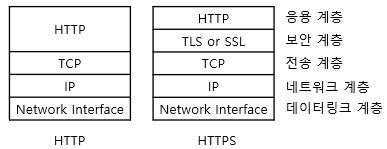
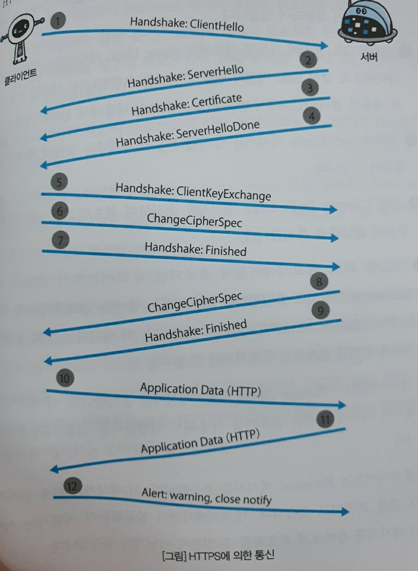

# 제 7장. 웹을 안전하게 지켜주는 HTTPS
## 7.1. HTTP 의 약점
- 평문 (암호화 하지 않은) 통신이기에 `도청 가능`
- 통신 상대를 확인하지 않기에 `위장 가능`
- 완전성을 증명할 수 없기에 `변조 가능`

### 7.1.1. 평문이기 때문에 도청 가능
- HTTP 를 사용한 리퀘스트/리스폰스 통신 내용은 **HTTP 자신을 암호화하는 기능은 없기에 통신 전체가 암호화 되지 않는다**
  - 즉, 평문 (암호화 되지 않은 메시지) 로 HTTP 메시지를 보내게 된다

#### TCP/IP 는 도청 가능한 네트워크
- TCP/IP 구조의 통신 내용은 **전부 통신 경로의 도중에 엿볼 수 있다**
- 통신 내용을 엿볼 수 있다는 것은, 암호화된 통신 / 암호화 되지 않은 통신 모두 동일하다
  - 암호화 통신은 메시지 속 의미는 간파할 수 없지만, 암호화된 메시지 자체는 엿볼 수 있다
- 인터넷은 모든 곳에서 통신 내용이 도청될 가능성이 있다
- 네트워크 상을 흐르고 있는 패킷을 수집하는 것만으로도 도청할 수 있다
  - 패킷을 수집하려면 패킷을 해석하는 패킷 캡처나 스니퍼 툴을 사용한다

#### 암호화로 도청을 피하다
1) 통신 암호화
- HTTP 에는 암호화 구조가 없지만 **SSL (Secure Socket Layer), TLS (Transport Layer Security) 라는 다른 프로토콜을 조합함으로써 HTTP 통신 내용을 암호화** 할 수 있다
- SSL 등을 이용해 안전한 통신로를 확립하고 나서 HTTP 통신을 한다
- SSL 을 조합한 HTTP 를 HTTPS (HTTP Secure) 나 HTTP over SSL 이라 불린다
2) 콘텐츠 암호화
- 통신하고 있는 **콘텐츠 내용 자체를 암호화**한다
- HTTP 에 암호화 기능이 없기에 HTTP 를 사용해서 운반하는 내용을 암호화하는 것이다
- 물론, 콘텐츠 암호화를 유효하게 하려면 클라이언트/서버가 콘텐츠 암호화/복호화 구조를 가지고 있어야 한다.
  - 평상시에 유저가 사용하는 브라우저와 웹 서버에서는 이용하기 어렵다

### 7.1.2. 통신 상대를 확인하지 않기 때문에 위장 가능
- **HTTP 를 사용한 리퀘스트/리스폰스에서는 통신 상대를 확인하지 않는다**

#### 누구나 리퀘스트할 수 있다
- HTTP 에 의한 통신에는 상대가 누구인지 확인하는 처리는 없기에 누구든지 리퀘스트를 보낼 수 있다
- 또한 리퀘스트가 오면, 상대가 누구든지 무언가의 리스폰스를 반환한다
- 약점
  - 위장한 웹 서버일 수 있다 (리퀘스트를 보낸 곳의 웹 서버 != 리스폰스를 보낸 웹 서버)
  - 위장한 클라이언트일 수 있다 (리스폰스 반환 한 곳의 클라이언트 != 리퀘스트를 보낸 클라이언트)
  - 통신하고 있는 상대가 접근 허가된 상대인지 확인할 수 없다
  - 의미없는 리퀘스트라도 수신하게 된다. 따라서 대량 리퀘스트에 의한 DoS 공격 (서비스 불능 공격)을 방지할 수 없다

#### 상대를 확인하는 증명서
- HTTP 에서는 통신 상대를 확인할 수 없지만 SSL 로 상대를 확인할 수 있다
- **SSL 은 암호화뿐만 아니라 상대를 확인하는 수단으로 증명서를 제공**한다
  - 증명서는 신뢰할 수 있는 제 3자 기관에 의해 발행되기에, 서버나 클라이언트가 실재함을 증명한다
  - 증명서를 위조하는 것은 기술적으로 굉장히 어렵다
- **통신 상대의 서버나 클라이언트가 가진 증명서를 확인함으로써, 통신 상대가 내가 통신하고자 하는 상대인지 여부를 판단할 수 있다**

### 7.1.3. 완전성을 증명할 수 없기 때문에 변조 가능
- 완전성 : 정보의 정확성
  - 완전성을 증명할 수 없다 == 정보가 정확한지 아닌지를 확인할 수 없다

#### 수신한 내용이 다를지도 모른다
- 만약 **리퀘스트, 리스폰스가 발신된 후에 상대가 수신할 때까지 변조되었다고 해도 이 사실을 알 수 없다**
- 중간자 공격 (Man-in-the-Middle) : 공격자가 도중에 리퀘스트/리스폰스를 빼앗아 변조하는 공격

#### 변조를 방지하려면?
- MD5 나 SHA-1 등의 해시 값을 확인하는 방법과 파일의 디지털 서명을 확인하는 방법이 존재한다
- 파일 다운로드 서비스를 제공하는 웹사이트에서는 PGP (Pretty Good Privacy) 에 의한 서명와 MD5에 의한 해시값을 제공한다
  - PGP : 파일을 작성했다는 증명을 위한 서명
  - MD5 : 단방향성 함수에 의한 해시 값
  - 어느쪽을 사용하더라도 클라이언트를 이용하고 있는 유저 자신이 다운로드 받은 파일을 토대로 검사해야 한다
- 아쉽게 이 방법으로 확실히 확인할 수는 없다. 
  - PGP, MD5 자체도 적절히 수정되어 있으면 유저로서는 알 방법이 없다
- 확실히 방지하기 위해서 HTTPS 를 사용해야 한다
  - **SSL 에는 인증, 암호화, 다이제스트 기능을 제공한다**
    - 암호화 : 정해직 규칙에 근거하여 데이터를 변환하는 기술 (도청 방지)
    - 메시지 다이제스트 (메시지 압축 알고리즘) : 데이터로부터 고정 길이 데이터를 꺼내는 계산 (변조 방지)
    - 디지털 증명서 : 통신을 하는 상태가 원하는 상대인지를 증명하는 파일 (위장 방지)
  - HTTP 만으로는 완전성을 보증하기 어렵기 때문에 다른 프로토콜을 조합함으로써 실현하고 있다

## 7.2. HTTP + 암호화 + 인증 + 완전성 보호 = HTTPS
### 7.2.1. HTTP에 암호화와 인증과 완전성 보호를 더한 HTTPS
- HTTP 통신은 **암호화되지 않은 평문**으로 실시된다
- HTTP 에는 통신 상대의 서버나 클라이언트를 **인증하는 수단이 없다**
- 수신한 메시지가 **도중에 변조되어 있을 가능성**도 있다
- HTTPS (HTTP Secure) : HTTP 에 암호화나 인증 등의 구조를 더한 것 
  - HTTPS : HTTP + 통신의 암호화 + 증명서 + 완전성 보호

### 7.2.2. HTTPS 는 SSL 의 껍질을 덮어쓴 HTTP
- HTTPS 는 새로운 애플리케이션 계층의 프로토콜은 아니다
- 보통 HTTP 는 직접 TCP 와 통신하지만, **SSL 을 사용하는 경우 HTTP는 SSL와 통신하고, SSL이 TCP와 통신하게 된다.**
    - 즉, SSL 이라는 껍질을 덮어쓴 HTTP 가 HTTPS 이다.
  

- SSL 은 현재 세계 어느곳에서도 널리 사용되고 있는 네트워크 보안 기술이다.

### 7.2.3. 상호간에 키를 교환하는 공개키 암호화 방식
- SSL 에서는 공개키 암호화 방식을 채용하고 있다
  - 알고리즘이 공개되어 있고, 키를 비밀에 부침으로써 안전성을 유지하며, 암/복호화 시 이 키를 사용한다

#### 공통키 암호의 딜레마
- 공통키 암호 : 암호화, 복호화에 하나의 키를 같이 사용하는 방식
- 공통키 암호화 방식은 상대에게 키를 넘겨 주어야 하는데, 네트워크를 사용해서 키를 넘겨줄 때 통신이 도청되는 경우 공격자에게 키를 뺏기게 되면 암호화의 의미가 없어진다
- **키를 보내면 도청될 가능성이 있고, 키를 보내지 않으면 복호화 할 수 없다**

#### 두 개의 키를 사용하는 공개키 암호
- 공통키 암호의 문제를 해결하려고 한 것이 공개키 암호이다
- 서로 다른 2개의 키 페어 쌍을 사용하는데, 한쪽은 비밀키, 한쪽은 공개키이다.
- 공개키 암호를 사용한 암호화
  - 암호를 보내는 측이 상대의 공개키를 사용해 암호화 한다
  - 암호화된 정보를 받은 상대는 자신의 비밀키를 사용해 복호화를 실시한다
- 이 방식은 암호를 푸는 비밀키는 통신으로 보내지 않아도 되므로 도청에 의한 걱정은 없다

#### HTTPS 는 하이브리드 암호 시스템
- HTTP : 공통키 암호, 공개키 암호의 양쪽 성질을 가진 하이브리드 암호 시스템
  - 공개키 암호는 공통키 암호에 비해 처리 속도가 느리므로, 2가지 장점을 살리도록 각각 방식을 조합하여 통신한다
- **키를 교환하는 곳에서는 공개키 암호를 사용, 그 후 통신에서 메시지를 교환하는 곳에서는 공통키 암호를 사용한다**
  - 공통키 암호로 사용하는 키를 공개키 암호를 사용해서 안전하게 교환한다

### 7.2.4. 공개키가 정확한지 아닌지를 증명하는 증명서
- 공개키 암호는 공개키가 진짜인지 아닌지 증명할 수 없다는 문제가 있다
- 이 문제를 해결하려고 인증 기관 (CA) 과 그 기관이 발행하는 공개키 증명서가 이용되고 있다
1. 서버의 운영자가 인증기관에 공개키를 제출한다
2. 인증기관은 제출된 공개키에 디지털 서명을 하고, 서명이 끝난 공개키를 만든다.
3. 공개키 인증서에 서명이 끝난 공개키를 담는다
4. 서버는 인증 기관에 의해 작성된 공개키 인증서를 클라이언트에 보내고, 공개키 암호로 통신한다
5. 증명서를 받은 클라이언트는 증명 기관의 공개키를 사용해서 서버의 공개키 인증해준 것이 진짜 인증기관이라는 것과 서버의 공개키가 신뢰할 수 있음을 알 수 있다
- 여기서 사용되는 증명기관의 공개키는 안전하게 클라이언트에 전달되어야 한다.
- 따라서 많은 브라우저가 주요 인증 기관의 공개키를 사전에 내장한 상태로 제품을 내놓고 있다

#### 조직의 실제성을 증명하는 EV SSL 증명서
- 증명서의 역할은 서버가 올바른 통신 상대임을 증명하는 것이지만, 상대방이 실제 있는 기업인지를 확인하는 역할을 하는 증명서도 있는데, 이를 EV SSL 증명서라고 한다

#### 클라이언트를 확인하는 클라이언트 증명서
- 클라이언트 증명서를 이용하여 서버 증명서와 같이 서버가 통신하고 있는 상대가 의도한 클라이언트 인 것을 증명하는 클라이언트 인증을 할 수 있다
- 안전성이 매우 높은 인증 기능을 제공할 수 있지만, 유저수만큼 클라이언트 증명서를 구입해야 하므로 그정도의 비용을 들일 필요가 있는 곳에서만 사용되고 있다
  - ex. 은행 인터넷 뱅킹에서, 로그인 시 ID/PW 로 본인 확인을 할 뿐만 아니라 클라이언트 증명서를 요구하여 특정 단말기에서 액세스 여부를 확인할 수 있다

#### 인증 기관은 신용이 제일
- SSL 은 인증 기관을 신용할 수 있다는 전제로 이루어져 있다
 
#### 자기 인증 기관 발행 증명서는 '나야 나' 증명서
- OpenSSL 등의 소프트웨어를 사용하면 누구든 인증 기관을 구축하여 서버 증명서를 발행할 수 있다.
  - 그러나 이 서버 증명서는 인터넷 상에서는 증명서로서 구실하지 못하며 쓸모가 없다
- 자기 인증 기관이 발행한 서버 증명서가 쓸모 없다는 것은 위장 가능성이 있기 때문이다
- 통신은 암호화되어 있어도 위장하고 있는 가짜 서버와 통신하고 있을 가능성이 있다

### 7.2.5. 안전한 통신을 하는 HTTPS 의 구조

1. Client : Client Hello의 메시지 전송으로 SSL 통신 시작
2. Server : SSL 통신이 가능한 경우 Server Hello 메시지로 응답
3. Server : 공개키 증명서가 포함된 Certificate 메시지 송신
4. Server : Server Hello Done 메시지 송신하여 최초의 SSL 네고시에이션 끝났음을 통지
5. Client : SSL 의 최초 네고시에이션 종료 시 Client Key Exchange 메시지로 응답
   - 메시지에는 통신을 암호화하는 데 사용하는 Pre-Master secret 포함
   - 이 메시지는 3번에서 받은 공개키 증명서에서 꺼낸 공개키로 암호화되어 있다
6. Client : 앞으로 암호키 사용해서 진행한다는 Change Cipher Spec 메시지를 전송
7. Client : Finished 메시지 전송
   - 네고시에이션 성공 여부는 서버가 이 메시지를 올바르게 복호화할 수 있는지 아닌지가 결정
8. Server : Change Cipher Spec 메시지 전송
9. Server : Finished 메시지 송신
10. Client : Finished 메시지 교환 완료 시 SSL 접속 확립 후 HTTP 리퀘스트 송신
    - 통신은 SSL 에 의해 보호된다
    - 이제부터는 애플리케이션 계층의 프로토콜에 의해 통신한다
11. Server : HTTP 리스폰스 송신 (애플리케이션 계층의 프로토콜에 의한 통신)
12. Client : close_notify 메시지 송신 후 접속 종료. 이후 TCP FIN 메시지를 보내 TCP 통신 종료

#### SSL 과 TLS
- HTTPS 에서는 SSL (Secure Socket Layer) 과 TLS (Transport Layer Security) 라는 2개의 프로토콜을 사용한다
- TLS 는 SSL 을 바탕으로 한 프로토콜이지만, 이 프로토콜을 총칭해서 SSL 이라고 부르기도 한다.

#### SSL 은 느리다?
- TCP 접속과 HTTP 리퀘스트/리스폰스 이외에 **SSL 에 필요한 통신이 추가되므로, 전체적으로 처리해야 할 통신이 증가**하므로 통신 처리에 시간이 걸린다
- SSL 은 반드시 암호화 처리를 하기에 서버나 클라이언트에서는 암/복호화 계산이 필요하다.
  - 따라서 **서버나 클라이언트의 리소스를 소비하게 되어 HTTP 에 비해 부담이 커진다**
- 느려지는 것에 대한 근본적 해결 방법은 없기 때문에, SSL 액셀레이터라는 하드웨어를 사용해서 이 문제를 해결하기도 한다
  - SSL 을 처리하기 위한 전용 하드웨어로, SSL 을 처리할 때보다 몇 배 빠른 계산이 가능하다

#### 왜 항상 HTTPS 를 사용하지 않는가?
- **평문 통신에 비해 암호화 통신은 CPU 나 메모리 등 리소스가 많이 필요하기 때문이다**
  - 통신할 때마다 암호화를 하면 **많은 리소스를 소비하기에 한 대 당 처리할 수 있는 리퀘스트 수가 줄어든다**
  - 그렇기 때문에 민감 정보를 포함하지 않는 통신에서는 HTTP 사용
  - 개인 정보 등 민감한 정보 다룰 때만 HTTPS 에 의한 암호화 통신 사용
- 액세스가 많은 웹 사이트 등에서 암호화를 하면 부하가 상당하다.
  - 암호화 사용하는 경우에는 모든 콘텐츠가 아니라 **숨겨야 할 정보만 암호화함으로써 리소스를 절약한다**
- 그 외에는 인증서를 발급하기 위해 증명서의 구입비용을 지불해야 한다는 점 때문에 증명서 구입이 부담되거나 개인 웹 사이트에서는 HTTP 만 선택하기도 한다.