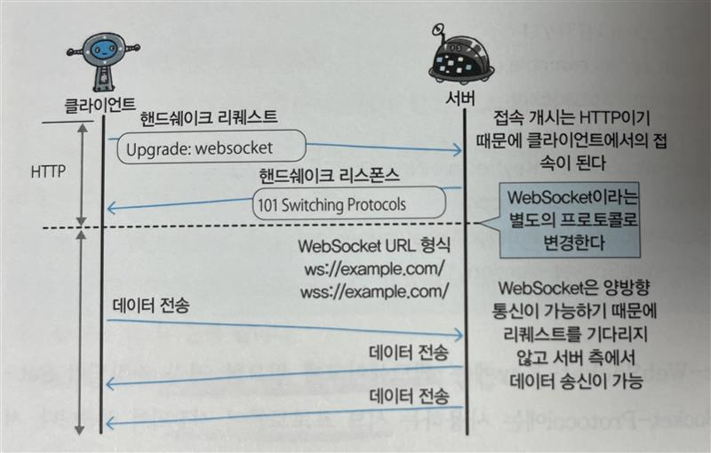

# 제 9장. HTTP 에 기능을 추가한 프로토콜
## 9.3. 브라우저에서 양방향 통신을 하는 WebSocket
### 9.3.1. WebSocket 의 설계와 기능
- WebSocket 은 웹 브라우저와 웹 서버를 위한 양방향 통신 규격

### 9.3.2. WebSocket 프로토콜
- WebSocket 은 웹 서버와 클라이언트가 한번 접속을 확립하면 그 뒤의 통신을 모두 전용 프로토콜로 하는 방식
  - JSON, XML, HTML, 이미지 등 임의 형식의 데이터를 보내게 됨
- HTTP 에 의한 **접속의 출발점이 클라이언트에 있다**는 것은 변함이 없지만, **한번 접속을 확립하면 WebSocket 을 사용하여 서버와 클라이언트 어느 쪽에서도 송신을 할 수 있다**

#### 서버 푸시 기능
- 서버에서 클라이언트의 리퀘스트를 기다리지 않고 데이터를 보낼 수 있다

#### 통신량의 삭감
- 접속을 한번 확립하면 접속을 유지한다.
- **HTTP 에 비해서 자주 접속하는 오버헤드가 적고**, 헤더 사이즈도 작기에 통신량을 줄일 수 있다
- WebSocket 으로 통신하려면 한번 HTTP 에 접속을 확립하고, WebSocket 에 의해 통신하기 위해서 핸드쉐이크 절차를 밟아야 한다.

#### 핸드쉐이크/리퀘스트
- WebSocket 으로 통신하려면 **HTTP 의 Upgrade 헤더 필드를 사용**해서 프로토콜을 변경하는 것으로 핸드쉐이크를 실시한다.
```http
GET /chat HTTP/1.1
Host: server.example.com
Upgrade: websocket
Connection: Upgrade
Sec-WebSocket-Key: dGhlIHNhbXBsZSBub25jZQ==
Origin: http://example.com
Sec-WebSocket-Protocol: v10.stomp, v11.stomp, my-team-custom
Sec-WebSocket-Version: 13
```
- Sec-WebSocket-Key : 핸드쉐이크에 필요한 키 저장
- Sec-WebSocket-Protocol : 사용하는 서브 프로토콜 저장
  - WebSocket 프로토콜에 의한 커넥션을 여러개로 구분하고 싶을 때 이름 붙여서 정의

#### 핸드쉐이크/리스폰스
```http
HTTP/1.1 101 Switching Protocols
Upgrade: websocket
Connection: Upgrade
Sec-WebSocket-Accept: s3pPLMBiTxaQ9kYGzzhZRbK+xOo=
```
- 핸드쉐이크에 의해 WebSocket **커넥션이 확립된 후에는 HTTP 가 아닌 WebSocket 독자적인 데이터 프레임을 이용해 통신**

